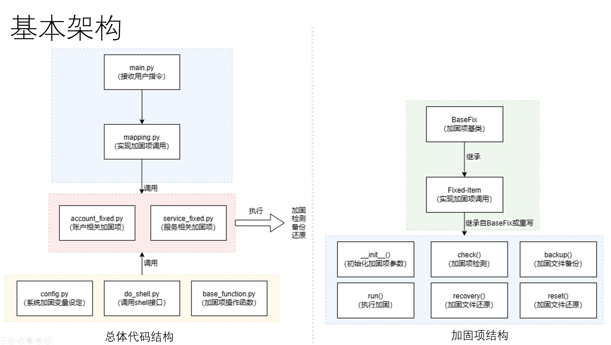

# security-baseline

#### 介绍
ecurity-baseline是天翼云科技有限公司孵化的自主创新项目，旨在通过修改系统配置文件，优化系统设置，从而提升系统的整体安全性。这些配置修改包括但不限于用户权限管理、网络设置优化、服务配置调整等，确保系统在各个层面都具备更高的安全防护能力。

#### 软件架构



#### 软件功能

- 系统配置加固： Security-Baseline 通过修改系统配置文件，优化系统设置，从而提升系统的整体安全性。这些配置修改包括但不限于用户权限管理、网络设置优化、服务配置调整等，确保系统在各个层面都具备更高的安全防护能力。
- 加固检测： 该工具能够检测系统设置项目是否符合加固相关的要求，并生成详细的加固报告。通过加固检测，用户可以清晰了解系统当前的基线安全状态，并根据报告中的建议进行相应的调整和优化。
- 设置备份： 在进行加固操作之前，Security-Baseline 会自动备份涉及的设置文件。这一功能确保用户在加固过程中可以随时回退到之前的状态，避免因加固操作导致的系统异常或功能失效。
- 加固还原： 当加固操作导致系统出现异常时，Security-Baseline 支持将加固项还原到加固之前的状态。如果没有可还原的备份设置文件，工具还能够将加固项还原到系统的初始状态，确保系统的稳定性和可用性。
- 持续监测：Security-Baseline能够实时检测系统设置项是否符合安全基线规范要求，如不符合，可通过用户设定的渠道（如邮箱、企业微信、钉钉）告知用户，或根据用户设定自动修改。


#### 安装教程
##### rpm包安装
1.  rpmbuild -ba *.spec
2.  yum install security-baseline*.rpm

#### 二进制安装
make install

#### 使用说明

1.  加固项检测(不附加任何参数时默认执行加固检测)
```
security-baseline
```
2.  加固项加固
```
security-baseline --mode fix
```
3.  加固项还原
```
security-baseline --mode reset
```
4.  加固项备份
```
security-baseline --mode backup
```
5.  加固项修复
```
security-baseline --mode recovery
```
5.  加固项检测
```
security-baseline --mode check
```

6.  默认操作1-5会操作所有加固项，可以指定加固项目
```
security-baseline --mode {fix/check/backup/recovery/check} --opt 1,2,3....
```


#### 参与贡献

1.  Fork 本仓库
2.  新建 Feat_xxx 分支
3.  提交代码
4.  新建 Pull Request


#### 开发计划
项目目前处于集中开发期，先期上线的版本为0.1.1版本，主要实现基础加固相关功能。

加固项守护、多系统版本支持已经完成开发，待内部测试通过后近期会上线。同时优化后的设置项、设置项表示，也会在测试稳定后逐步上线。

在上述基本功能上线稳定后，本项目将继续实现以下研发规划：
1.功能增强：前期主要以安全加固为目标，下一阶段准备往系统优化的方向演进。同时，考虑继续设计更多的安全加固项（如精细化访问控制等），优化加固检测结果展示，以应对更高的系统安全需求。
2.操作简化：虽然目前操作已经足够简化，但设置存在进一步简化的空间（可视化选择框支持），根据国标不同安全要求等级不同要求，设计具体的加固模版来进行加固操作。
3.框架优化：目前加固功能实现以Python为主，后续考虑梳理加固项关系，提升框架灵活性（支持接入其它语言编写的加固项并动态加载），进一步简化加固项表示，降低开发难度。
4.复杂加固需求支持：后续考虑支持复杂的系统加固项，如防火墙策略、SELINUX策略实施。
5.加固快照：支持以快照为单位生成加固项快照，提升加固还原的可行性。


